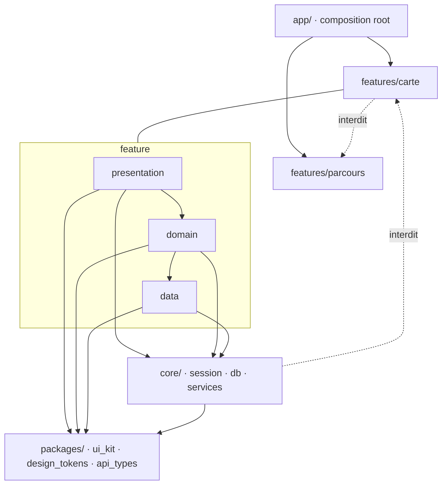
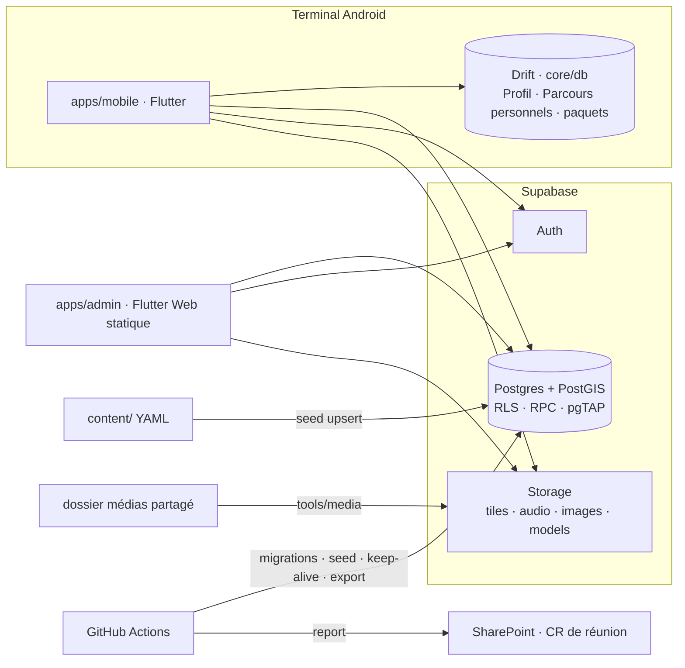

# Architecture Spine — HistoLyon

## Design Paradigm

**Monorepo Dart schema-first.** Un dépôt, un langage applicatif (Dart/Flutter, mobile et back-office), un schéma (Postgres via Supabase) dont tout le reste est dérivé, et dont les transitions d'état sont des fonctions SQL.

| Modèle | Où | Ce qu'il fixe |
| --- | --- | --- |
| **Feature-first à couches strictes** | `apps/*/lib/features/<slug>/{data,domain,presentation}` | Un dossier par domaine fonctionnel (D1…D11) ; dépendances vers le bas ; jamais de feature à feature ; `app/` seul assemble |
| **Schema-first, transitions en SQL** | `supabase/` | Le SQL versionné est le backend ; invariants = contraintes + RLS ; transitions de cycle de vie = RPC avec Trace ; types clients générés |
| **Trunk-based par stories élémentaires** | GitHub + `docs/` | La story est la plus petite unité de travail ; `main` toujours livrable ; l'avancement se lit dans le dépôt |

## Invariants & Rules

### AD-1 — Un seul langage applicatif : Dart / Flutter, mobile et back-office [ADOPTED]

- **Binds:** all
- **Prevents:** une deuxième stack (web TS) pour une équipe où personne ne connaît encore Flutter ; deux générations de types ; des tokens de design dupliqués.
- **Rule:** `apps/mobile` (Android) et `apps/admin` (Flutter Web, renderer CanvasKit, `SemanticsBinding.ensureSemantics()` au démarrage) sont des apps Flutter du même workspace Pub (racine `pubspec.yaml` `workspace:`, melos = lanceur de scripts) ; tout code partagé vit dans `packages/` ; aucune app non-Dart n'entre dans le dépôt sans amendement de cette AD.

### AD-2 — Le schéma SQL versionné est l'unique vérité du backend, et la logique serveur est du SQL

- **Binds:** C1–C6, I1–I10, `apps/*`, `content/`, `tools/`
- **Prevents:** mobile, admin et seed qui « possèdent » chacun leur idée du schéma ; invariants réimplémentés (et divergents) dans chaque client ; logique serveur éparpillée entre SQL et fonctions TS.
- **Rule:** toute modification de base passe par `supabase/migrations/` ; aucune modification manuelle d'un projet ; chaque invariant I1–I10 est une contrainte SQL et/ou une policy RLS avec son test pgTAP dans `supabase/tests/` ; la logique serveur est écrite en fonctions SQL/plpgsql exposées en RPC — les Edge Functions n'entrent que par amendement ; un client ne réimplémente un invariant que comme validation de confort. Les rôles d'équipe sont une table `membre_equipe(compte_id, role)` avec `role` enum `editeur | validateur | moderateur`, créée dans la migration socle et portée par les policies ; les apps n'embarquent que la clé publiable, la clé secrète ne vit qu'en CI et dans `tools/`.

### AD-3 — Les types clients sont générés, jamais écrits à la main

- **Binds:** `apps/*`, `packages/api_types`, `content/schema`
- **Prevents:** des modèles Dart rédigés à la main qui dérivent du schéma ; deux PR qui « résolvent » un conflit sur du généré à la main.
- **Rule:** `packages/api_types` (Dart) et `content/schema/*.json` (JSON Schema) sont produits par `tools/gen-types` à partir du schéma local ; régénérés et committés dans la PR de toute migration ; la CI échoue si la génération diffère du commit ; un conflit Git sur un fichier généré se résout en régénérant, jamais à la main. Outil courant : supadart (enums déclarés dans `supadart.yaml`, PostGIS via `geobase`) ; bascule vers `supabase_typegen` officiel quand `supabase_flutter` 3 est stable.

### AD-4 — Ownership des données par provenance : serveur / terminal

- **Binds:** C2, C3, C6, I2, I6, `mobile/lib/core/profile`, `mobile/lib/core/db`
- **Prevents:** un Parcours personnel « possédé par le serveur » (viole I6) ; un cache serveur transparent du Profil ; deux espaces d'identifiants (local int vs uuid) ; une sync sans règle de fusion.
- **Rule:** le **serveur** possède le contenu éditorial et communautaire (C1, C2 hors `personnel`, C4, C5, Lien universel) ; le **terminal** possède le Profil sans Compte (C3), les Parcours de provenance `personnel` et leurs Étapes, et les Images/Codes visuels générés localement — dans **une seule base Drift** (`core/db`, schéma versionné dans `core/db/schema.drift`). Les `uuid` sont générés côté client partout : un objet garde son id quand il monte au serveur. Partager un Parcours personnel par Lien universel (modèle capability de la conception) **exige un Compte** et passe par la RPC `parcours_partager` qui le pousse en visibilité `non_liste`. La synchronisation vers un Compte est un flux explicite, opt-in par catégorie, dans `core/profile/sync/` : union pour Favoris et Historique, dernier-écrit-gagne pour les préférences.

### AD-5 — Direction des dépendances dans une app

- **Binds:** `apps/*/lib`
- **Prevents:** deux features qui s'importent ; une UI qui appelle Supabase ; un `core/` qui dépend d'une feature ; un routeur central qui contredit la règle.
- **Rule:** dans une feature, `presentation → domain → data` sans inversion (`domain/` importe `data/` ; les entités serveur de `api_types` sont utilisées telles quelles, les modèles dérivés partagés vivent dans `core/models/`) ; chaque couche expose ses providers Riverpod, la couche du dessus les lit. Une feature n'importe jamais une autre feature ; ce qui est partagé descend dans `core/` (app) ou `packages/` (workspace) ; `core/` et `packages/` n'importent aucune feature. **`app/` est l'unique composition root** : il importe les features pour assembler le routeur (`app/router.dart` à partir des `GoRoute` exportées par chaque feature), le bootstrap et le `ProviderScope` ; `core/router` ne contient que noms et chemins de routes. Une feature n'interagit avec une autre que par navigation nommée ou par `core/session` (AD-20). Vérifié par lint d'imports en CI.



### AD-6 — Un seul écrivain par entité, transitions uniquement par RPC

- **Binds:** C1, C2, C4, I3, I4, I10, `apps/*/lib/features/*/data`, `supabase/`
- **Prevents:** quatre chemins d'écriture de `pin` (seed, admin, soumission communautaire, modération) avec quatre machines d'état implicites pour `statut` / `provenance`.
- **Rule:** toute écriture passe par le repository de la feature **propriétaire** (table ci-dessous) dans `data/` ; le client Supabase et les DAO Drift ne sont injectés que dans `data/`. Toute **transition** de `statut` ou de `provenance` est une fonction SQL exposée en RPC, qui écrit sa Trace (validation ou modération) et est testée en pgTAP ; les colonnes de cycle de vie ne sont pas modifiables par `UPDATE` direct (RLS + trigger) ; le repository n'est que l'appelant de la RPC.

| Entité | Création | Transitions (RPC) |
| --- | --- | --- |
| Pin `editorial` | `content/` seed (phase 1) · `admin/saisie` | `admin/validation` : `pin_soumettre`, `pin_valider`, `pin_publier`, `pin_retirer` |
| Pin `communautaire` | `mobile/communaute` | `admin/moderation` : `pin_moderer`, `pin_promouvoir` (I10) |
| Parcours `editorial` / `communautaire` | `admin/saisie` / `mobile/parcours` | `admin/validation` / `admin/moderation` |
| Parcours `personnel` | `mobile/parcours` (local) | `mobile/parcours` : `parcours_partager`, `parcours_publier` |
| Commentaire, Retour, Signalement | `mobile/communaute` | `admin/moderation` |
| Profil, Favori, Historique, Préférences | `mobile/core/profile` | — |
| Époque, Catégorie, Modèle 3D, Média | `content/` seed · `admin/catalogue` | — |

### AD-7 — Le contenu éditorial vit en fichiers ; les binaires vivent dans Storage

- **Binds:** D10, C1, C2, C5, `content/`, `tools/seed`, `tools/media`
- **Prevents:** un premier pin bloqué derrière l'admin ; un seed qui écrase l'état posé par l'admin ou efface les pins communautaires ; des binaires sans emplacement ni format ; un dépôt Git gonflé de médias.
- **Rule:** phase 1 : `content/` (YAML conformes aux templates du palier 8, validés contre `content/schema/`) est **la** source des entités `editorial` ; `tools/seed` est **upsert-only par `slug`**, ne touche que `provenance = editorial`, jamais `statut`, jamais une Trace, jamais une ligne communautaire ; la base est la vérité pour tout le reste. Les binaires ne sont **jamais** dans Git : `tools/media push` les téléverse depuis un dossier partagé hors dépôt vers Storage (`<bucket>/<slug>/<fichier>`), le YAML les référence par ce chemin, la CI vérifie l'existence et les formats (`webp` ≤ 500 Ko, `m4a`/AAC ≤ 5 Mo, `glb` ≤ 20 Mo). Phase 2 : dès que `apps/admin` couvre la saisie d'un Pin **et** que l'export automatique d'AD-19 tourne, la base devient la source, `content/` devient fixtures et export — bascule par amendement de cette AD.

### AD-8 — Cartographie : MapLibre, une seule chaîne de tuiles, un style de fond par Époque

- **Binds:** D1, palier 9, I7, `packages/map_styles`, `features/carte`, `tools/tiles`
- **Prevents:** tuiles image non stylables ; deux schémas de tuiles (en ligne vs hors-ligne) qui rendent les styles inutilisables dans un des deux cas ; couches de données perdues à chaque changement d'époque ; dépendance à une clé API.
- **Rule:** moteur `maplibre_gl` ≥ 0.27.1. **Une seule archive** `lyon.pmtiles` (schéma Protomaps basemap, extraite par `tools/tiles` en CI depuis le build Protomaps sur l'emprise de l'agglomération) hébergée dans le bucket `tiles` : servie en ligne par `pmtiles://https://…` (range requests) et copiée sur disque (`pmtiles://file://…`, jamais `asset://`) pour le hors-ligne. **Un style JSON de fond par Époque** dans `packages/map_styles/<slug-epoque>.json`, tous sur ce même schéma ; le slider ne fait que `setStyle`. Les couches de données (pins, tracés) sont ajoutées par `features/carte` avec des identifiants de couches identiques dans tous les styles et **ré-ajoutées après chaque `setStyle`**. Ajouter une Époque (I7) = une migration + un style dans la même PR. Attribution OpenStreetMap (ODbL) et Protomaps visible en permanence.

### AD-9 — Hors-ligne = paquet par Parcours, un seul propriétaire du cache local

- **Binds:** D1.1, D3.4, D4, D7, `core/offline`, `core/db`
- **Prevents:** un hors-ligne « tout Lyon » implicite ; trois DAO concurrents pour le contenu local ; une proximité qui suppose des pins que rien n'a préchargés.
- **Rule:** la seule unité de préchargement promise est le **Parcours** : ses pins, ses médias et — une fois pour tous les parcours — `lyon.pmtiles`. `core/offline` est l'unique propriétaire des paquets et de l'API de lecture du contenu local (`pinLocal`, `media`, `tuiles`) ; les features lisent par cette API, jamais par Drift. La politique de lecture est unique : serveur si en ligne, sinon paquet, sinon état hors-ligne du palier 7. Le cache de la carte en ligne est éphémère et n'est pas promis ; la proximité (D4) géofence localement sur les pins connus (cache éphémère + paquets), sans service push.

### AD-10 — Tokens et composants 1:1 avec la maquette Figma

- **Binds:** palier 10, palier 12, `packages/design_tokens`, `packages/ui_kit`
- **Prevents:** valeurs visuelles inventées ; renommage qui casse la traçabilité Figma ↔ code ; composants `comp-*` réimplémentés dans une feature.
- **Rule:** chaque variable et style Figma est une constante de `packages/design_tokens` nommée par **l'identifiant Figma verbatim**, `-` → `_` (`TOK_COLOR_PRIMARY`), lint de nommage désactivé dans ce seul package ; un identifiant = une constante, jamais un alias qui fusionne deux tokens ; `tools/check-tokens` compare l'export Figma au package en CI. Les composants `comp-*` de la maquette vivent dans `packages/ui_kit`, mapping tenu à la main dans `packages/ui_kit/FIGMA-MAP.md` (Code Connect indisponible) ; une feature ne crée un widget local que s'il n'existe pas comme `comp-*`. Aucune valeur visuelle littérale dans une feature ; pas de thème sombre.

### AD-11 — Contrat 3D/AR : le viewer est isolé derrière une interface

- **Binds:** D8, C1 (Modèle 3D), `features/immersion`
- **Prevents:** un moteur 3D qui contamine l'app ; des spécialistes 3D bloqués par l'archi ou l'inverse.
- **Rule:** assets glTF/GLB dans le bucket `models`, référencés par l'entité Modèle 3D avec sa licence ; l'app ouvre l'immersion via `features/immersion` qui expose `ImmersionViewer(modelRef)` ; le moteur est interne à cette feature et à ses spécialistes.

### AD-12 — La story est la plus petite unité de travail, traçable, dans un arbre Domaine → Épic → Story

- **Binds:** process, GitHub, `docs/specs/`, `docs/stories/`
- **Prevents:** des tâches trop larges pour une session ou un agent ; une découpe que seul le porteur sait faire ; un avancement non traçable.
- **Rule:** l'arbre de découpe est Domaine (D1…D11, `socle`) → Épic (un sous-domaine `Dx.y` ou un lot) → Story ; le Découpeur produit `docs/specs/`, les épics dans `docs/` et `docs/stories/` avec BMAD (`bmad-spec`, `bmad-create-epics-and-stories`) et les committe. Une story = **1 issue GitHub = 1 branche `story/<ID>-<slug>` = 1 PR**, label de domaine obligatoire, corps = `docs/stories/TEMPLATE.md` (format dev-story BMAD, aussi template d'issue) qui **cite** les extraits de conception par ID. Une story touche **une seule** feature, ou un seul de `supabase/`, `content/`, `packages/<x>` ; une story qui a besoin d'une migration et d'une UI se découpe en deux, la migration d'abord.

### AD-13 — Trunk-based : `main` toujours livrable, itération de deux semaines

- **Binds:** process, GitHub
- **Prevents:** branches longues qui divergent entre membres à temps partiel ; du code non relu ni testé sur `main` ; une CI qui n'a pas vu le résultat de fusion.
- **Rule:** `main` protégé ; toute modification arrive par PR liée à son issue ; fusion uniquement si CI verte **sur une branche à jour avec `main`** et une relecture par un autre membre ; squash merge ; l'itération est de deux semaines et aucune branche ne la dépasse.

### AD-14 — Tests d'abord, dans cet ordre, par couche

- **Binds:** all
- **Prevents:** des tests écrits après coup et adaptés au code ; des couches sans politique de test.
- **Rule:** le premier commit d'une branche de story contient ses tests (rouges) ; le relecteur vérifie l'ordre des commits **avant** le squash et coche le champ « tests d'abord » de la PR. Politique : `domain` → unitaires obligatoires ; `data` → contre Supabase local ; `presentation` → widget tests des composants `ui_kit` touchés ; `supabase/` → pgTAP par invariant et par policy ; `content/` → validation de schéma ; un seul `integration_test` (le parcours démo) en nightly. Hooks lefthook : pre-commit = format + lint + schéma contenu ; pre-push = analyze + tests du package touché. La couverture est publiée par package et **ne baisse jamais** (cliquet en CI).

### AD-15 — Architecture documentaire en quatre niveaux, un seul fichier d'instructions

- **Binds:** `AGENTS.md`, `docs/`, `conception/`, `docs/stories/`, `prompts/`
- **Prevents:** saturation de contexte ; instructions divergentes par IDE ; agents qui inventent faute de contexte ; une méthode réservée à ceux qui ont BMAD.
- **Rule:** L0 `AGENTS.md` (racine, `apps/*/`, `supabase/`) < 150 lignes chacun, **unique** source d'instructions — `CLAUDE.md`, `.cursor/rules/*`, `.github/copilot-instructions.md` sont générés par `tools/sync-agents` et jamais édités ; L1 `docs/` = cette spine, conventions, guides-recettes (un sujet par fichier) ; L2 `conception/` importée telle quelle, **jamais lue entière**, adressée par ID via `conception/INDEX.md` généré et `tools/ctx <ID>` ; L3 la story liste précisément les fichiers L1/L2 à lire. `prompts/` contient les prompts portables (dev-story, review, découpe) collables dans toute IA et une checklist « sans IA ».

### AD-16 — Trois environnements, migrations sérialisées et poussées par la CI

- **Binds:** `supabase/`, `.github/workflows/`, ops
- **Prevents:** une base modifiée à la main ; deux migrations concurrentes dont l'ordre diffère entre `local` et `dev` ; une démo cassée par une migration non rejouée.
- **Rule:** `local` (Supabase CLI, chaque poste, `db reset` + seed depuis `content/`) → `dev` (projet Supabase, migré et re-seedé automatiquement à chaque fusion sur `main`) → `demo` (projet vu par le jury, migré manuellement sur tag `demo-YYYY-MM-DD`). **Une migration par PR**, label `migration`, sérialisée par l'Intégrateur ; la CI rejoue `db reset` from scratch sur le commit de fusion et refuse un horodatage antérieur au dernier de `main`. Secrets et URLs dans les GitHub Environments et `--dart-define-from-file`, jamais dans le dépôt ; clés nommées `sb_publishable_*` / `sb_secret_*`.

### AD-17 — L'avancement est calculé depuis GitHub, avec des indicateurs indépendants de la taille des stories

- **Binds:** process, `tools/report`, `docs/sprint/`
- **Prevents:** un reporting manuel à chaque rendez-vous école ; des KPIs non mesurables ; un comptage de stories qui pousserait à les grossir ou à courir après un périmètre.
- **Rule:** `tools/report` produit `docs/sprint/reports/<date>.md` uniquement à partir des issues, PR, labels et artefacts CI : **état des lieux** (fait / en cours / reste, listé par domaine, jamais compté comme cible), **indicateurs** = sous-domaines `Dx.y` dont la DoD est atteinte sur le total du domaine, délai médian story → fusion, taux de CI verte, couverture par package, actions de rétro closes. Ce fichier est collé dans le compte-rendu de réunion sur SharePoint ; GitHub Projects remplace la liste de suivi.

### AD-18 — Rôles = casquettes tournantes en binôme, documentées a posteriori

- **Binds:** process, `docs/team/`
- **Prevents:** un goulet unique ; une organisation figée avant d'être connue ; rien à montrer au jury sur l'ajustement.
- **Rule:** chaque casquette (Pilote, Découpeur, Intégrateur, Gardien des tests, Gardien du design, Spécialiste 3D) a **deux** titulaires ; `docs/team/ROLES.md` est mis à jour quand un rôle change ; une rétro d'organisation est consignée dans `docs/team/retros/<date>.md` à chaque rendez-vous école, ses actions en issues `label:organisation`.

### AD-19 — Enveloppe Supabase gratuite : keep-alive, export hebdomadaire, budget par bucket

- **Binds:** ops, `.github/workflows/`, `supabase/`, Storage
- **Prevents:** le projet `demo` en pause le jour du jury (pause après 7 jours d'inactivité) ; la base comme seule copie du contenu sans sauvegarde ; le Storage (1 Go) saturé par un seul type de média.
- **Rule:** `dev` et `demo` sont les deux projets actifs autorisés ; une Action hebdomadaire interroge les deux (keep-alive) ; une Action hebdomadaire exporte `supabase db dump` + les buckets en artefact conservé ; budgets Storage : `tiles` 150 Mo, `audio` 400 Mo, `images` 200 Mo, `models` 200 Mo, vérifiés par `tools/media` ; base ≤ 500 Mo. Toute évolution (plan payant, autre hébergeur) passe par amendement.

### AD-20 — L'état de session est une liste fermée dans `core/session` ; les comportements transverses sont des services de `core/`

- **Binds:** D1.2, D3.5, D4, D7, comportements transverses du palier 3, `mobile/lib/core`
- **Prevents:** l'époque sélectionnée, le parcours actif ou le pin courant dupliqués dans chaque feature avec des types différents ; permissions, géolocalisation, mode présentation, audio ou partage réimplémentés par feature.
- **Rule:** `core/session` expose une **liste fermée** de providers : `epoqueSelectionnee`, `parcoursActif`, `etapeCourante`, `pinCourant`, `modePresentation`, `lectureAudio` ; toute feature qui les lit ou les écrit passe par là, et l'ajout d'un état de session est un amendement. Les comportements transverses sont des services de `core/` consommés par les features : `permissions` (juste-à-temps), `location`, `presentation_mode`, `audio_player` (arrière-plan), `share` (partage natif), `offline`, `db`, `profile`. La règle de priorité entre geste utilisateur et positionnement automatique par le parcours sur `epoqueSelectionnee` est une question ouverte dont `core/session` est propriétaire.

## Consistency Conventions

| Concern | Convention |
| --- | --- |
| Langue des identifiants | Français du glossaire palier 4, sans accent : `snake_case` en SQL/fichiers, `lowerCamelCase` en Dart — `pin`, `epoque`, `parcours`, `etape`, `profil`, `compte`, `source_documentaire`. Dossiers de features : `carte` (D1), `pins` (D2), `parcours` (D3), `proximite` (D4), `onboarding` (D5), `profil` (D6), `audio` (D7), `immersion` (D8), `communaute` (D9), `partage` (D11) ; admin : `catalogue`, `saisie`, `validation`, `moderation`. |
| Identifiants de données | PK `id uuid` partout, générés côté client ; les entités éditoriales (Pin, Parcours, Époque, Catégorie, Modèle 3D) ont en plus `slug text unique` = clé de seed et d'URL. |
| Dates & géo | `timestamptz` en UTC ; positions en `geography(Point, 4326)` ; jamais lat/lon en colonnes séparées. |
| Statut & provenance | Deux colonnes distinctes en enums Postgres, valeurs = palier 4 ; jamais un booléen `publie`. |
| Polymorphisme (Signalement, Favori, Lien universel) | `(type_de_cible enum, cible_id uuid)` + contrainte CHECK ; pas de tables de jointure par type. |
| Erreurs | `data` renvoie `Result<T, Failure>` (`Failure` sealed dans `core/models`) ; `presentation` n'attrape jamais d'exception Supabase/Drift. |
| État | Riverpod avec `@riverpod` (riverpod_generator) ; pas de `setState` au-delà du widget local ; navigation par routes nommées `go_router` (noms dans `core/router`, assemblage dans `app/`). |
| Auth | Supabase Auth ; `auth.users.id` = `compte.id` ; RLS par `auth.uid()` et `membre_equipe.role` ; un fournisseur tiers n'est admis que s'il n'importe aucune identité civile (I1). |
| Vie privée | Aucun SDK d'analytics ni de tracking ; les logs ne contiennent aucun identifiant utilisateur. |
| Langue | Français uniquement (palier 8, 06-i18n) : `supportedLocales = [fr]`, formats `fr_FR` ; textes UI dans un ARB `fr` dont les clés sont les ids de microcopy du palier 8 ; pas de contenu éditorial multilingue. |
| Refus hérités de l'essence | Pas de thème sombre, pas de turn-by-turn, pas d'inscription obligatoire, pas de notification de proximité par défaut. |
| Usage de l'IA | Chaque PR déclare l'assistance IA (outil, ce qui a été généré) ; relecture humaine obligatoire ; les prompts utilisés en équipe sont versionnés dans `prompts/`. |
| Config & secrets | `--dart-define-from-file=env/<env>.json` ; jamais de constante d'URL/clé dans le code ; `env/demo.json` hors dépôt. |
| Dépendances | `pubspec.lock` committé ; montées de version dans des PR dédiées `label:deps`. |
| Release mobile | Version semver dans `pubspec.yaml`, build number = numéro de run CI ; clé de signature Android en secret d'Environment. |
| Licences | Attribution OSM (ODbL) et Protomaps affichée ; `licence` obligatoire sur Média, Fragment musical et Modèle 3D récupérés sur internet. |
| Observabilité | Logs Supabase + `core/log` (niveaux, sans PII) ; rien de plus tant qu'un besoin n'est pas documenté. |
| Commits | Conventional Commits `type(scope): sujet`, `scope` = slug de feature ou `supabase`/`content`/`docs` ; le corps cite `#<issue>`. |

## Stack

| Name | Version |
| --- | --- |
| Flutter (stable) / Dart | 3.47.4 / 3.13.3 |
| flutter_riverpod · riverpod_annotation · riverpod_generator · riverpod_lint | 3.4.3 · 4.0.7 · 4.0.9 · 3.1.9 |
| go_router | 18.0.1 |
| drift · drift_dev · drift_flutter | 2.35.0 · 2.35.0 · 0.3.1 |
| build_runner | 2.16.1 |
| supabase_flutter | 2.17.2 |
| maplibre_gl | 0.27.1 |
| melos (lanceur de scripts sur workspace Pub) | 8.7.0 |
| flutter_lints | 6.0.0 |
| Supabase CLI (`db reset`, `test db` pgTAP) | 2.117.0 |
| supadart | 1.9.3 |
| go-pmtiles (`pmtiles extract`) | 1.31.2 |
| lefthook | 2.1.14 |
| Tuiles vectorielles | Protomaps basemap (build PMTiles) |
| Forge & CI | GitHub (Issues, Projects, Actions, Environments) |

## Structural Seed



```text
histolyon/
  README.md                 # porte d'entrée : structure / organisation / dev, en une page
  AGENTS.md                 # L0 — unique ; généré vers CLAUDE.md, .cursor/rules, copilot-instructions
  pubspec.yaml              # workspace Pub + section melos
  lefthook.yml
  .devcontainer/            # Flutter (fvm) + Android SDK + Supabase CLI + lefthook + melos préinstallés
  .github/
    workflows/              # ci-mobile, ci-admin, ci-supabase, ci-content, ci-docs, nightly-e2e ; report/keep-alive/export = Epic 10
    ISSUE_TEMPLATE/story.md # = docs/stories/TEMPLATE.md
    PULL_REQUEST_TEMPLATE.md  # champs : issue liée, tests d'abord, assistance IA
  apps/
    mobile/                 # Flutter Android
      AGENTS.md
      lib/
        app/                # composition root : router.dart, bootstrap, ProviderScope
        core/               # router (noms), session, db, models, log, profile, offline,
                            # permissions, location, presentation_mode, audio_player, share
        features/<slug>/{data,domain,presentation}/
    admin/                  # Flutter Web
      AGENTS.md
      lib/{app,core,features}/
  packages/
    design_tokens/          # ids Figma verbatim
    ui_kit/                 # comp-* + FIGMA-MAP.md
    api_types/              # GÉNÉRÉ
    map_styles/             # <slug-epoque>.json — schéma Protomaps
  supabase/
    AGENTS.md
    migrations/             # vérité du schéma ; une par PR
    functions_sql/          # RPC de transition (inclus par les migrations)
    tests/                  # pgTAP — par invariant Ix, par policy, par RPC
  content/
    schema/                 # GÉNÉRÉ (JSON Schema)
    pins/  parcours/  epoques/  categories/  modeles3d/
    medias.yaml             # manifeste bucket/slug/fichier → licence
  conception/               # L2 — importé tel quel
    INDEX.md                # GÉNÉRÉ — id → fichier#ancre
  docs/
    ARCHITECTURE-SPINE.md    # cette spine — copie unique, source de vérité des règles
    ORGANISATION.md          # guide d'équipe narratif : pourquoi le dépôt est organisé ainsi
    BOOTSTRAP.md             # comment le socle a été construit, étape par étape
    DECISIONS.md             # journal chronologique des décisions (pourquoi, jamais réécrit)
    conventions/  guides/    # un sujet par fichier
    specs/  stories/         # docs/specs/spec-histolyon-socle/SPEC.md ; sprint-status.yaml + stories dans stories/
    sprint/                  # reports/ (tools/report)
    team/                    # ROLES.md, retros/
  prompts/                  # dev-story, review, decoupe + checklist sans IA
  tools/                    # ctx, gen-types, sync-agents, report, seed, media, tiles, check-tokens
  env/                      # local.json, dev.json (demo.json hors dépôt)
```

## Capability → Architecture Map

| Capability / Area | Lives in | Governed by |
| --- | --- | --- |
| D1 Carte et exploration temporelle | `mobile/features/carte`, `packages/map_styles`, `core/session.epoqueSelectionnee` | AD-5, AD-8, AD-10, AD-20 |
| D2 Pins et contenu | `mobile/features/pins`, tables `pin`, `media`, `source_documentaire` | AD-2, AD-6, AD-7 |
| D3 Parcours | `mobile/features/parcours`, `core/offline`, `core/session.parcoursActif` | AD-4, AD-6, AD-9, AD-20 |
| D4 Notifications de proximité | `mobile/features/proximite`, `core/location` | AD-9, AD-20 |
| D5 Onboarding | `mobile/features/onboarding`, `core/permissions` | AD-5, AD-10, AD-20 |
| D6 Profil et compte | `mobile/core/profile`, `features/profil`, Supabase Auth | AD-4, AD-2 (I1, I6), convention Auth |
| D7 Audio et narration | `mobile/features/audio`, `core/audio_player`, bucket `audio` | AD-9, AD-20 |
| D8 3D et AR | `mobile/features/immersion`, bucket `models` | AD-11 |
| D9 Communauté | `mobile/features/communaute`, RLS I2/I3/I5, RPC de modération | AD-2, AD-6 |
| D10 Production de contenu | `content/`, `tools/seed`, `tools/media`, puis `apps/admin` | AD-7, AD-6, AD-1, AD-3 |
| D11 Surfaces hors-app | `mobile/features/partage`, `core/share`, table `lien_universel` ; page publique différée | AD-4, AD-6, Deferred |
| Comportements transverses | `mobile/core/*` | AD-20 |
| Organisation & suivi | GitHub, `docs/`, `prompts/`, `tools/report` | AD-12 → AD-18 |
| Enveloppe opérationnelle | Supabase `dev`/`demo`, Actions | AD-16, AD-19 |

## Deferred

| Décision | Pourquoi ça peut attendre | Condition de revisite |
| --- | --- | --- |
| Moteur 3D/AR (viewer Flutter, WebView, Unity bridge) | Isolé par AD-11 | Premier spike livré dans `features/immersion` |
| iOS (build, TestFlight) | Pas de Mac ni de licence Apple Developer | Un Mac + une licence disponibles |
| Page web publique lecture seule + payload Open Graph (D11) | Ni mobile ni admin ; piste : fonction SQL rendant un HTML minimal, ou Edge Function par amendement d'AD-2 | Mise en chantier du lien universel |
| Schéma du lien universel (domaine, chemin) | Dépend d'un nom de domaine | Idem |
| Priorité geste utilisateur / positionnement par parcours sur `epoqueSelectionnee` | Question ouverte D1.2 ; propriétaire fixé (`core/session`) | Première story qui fait piloter le slider par un parcours |
| Méthode d'authentification (mot de passe / magic link / tiers) | Fournisseur fixé ; méthode = décision d'UI D6 sous la convention Auth | Première story de création de Compte |
| Hébergeur de `apps/admin` (GitHub Pages / Cloudflare Pages) | Statique, interchangeable ; `--wasm` exclu sur GitHub Pages (en-têtes COOP/COEP) | Première PR de l'admin |
| Bascule `content/` → admin comme source (phase 2 d'AD-7) | L'admin et l'export hebdo n'existent pas encore | Saisie de Pin fonctionnelle + export AD-19 actif |
| Outillage de modération et de validation (D9/D10) | Schéma, rôles et RPC déjà fixés (AD-2, AD-6) | Ouverture de D9 |
| Taille réelle de `lyon.pmtiles` et emprise exacte | Estimée < 150 Mo ; à mesurer | Premier run de `tools/tiles` |
| Seuils chiffrés de performance (fps, latences) | Palier 16 de la conception | Rédaction du palier 16 |
| supadart → supabase_typegen | Règle AD-3 indépendante de l'outil | `supabase_flutter` 3 stable |
